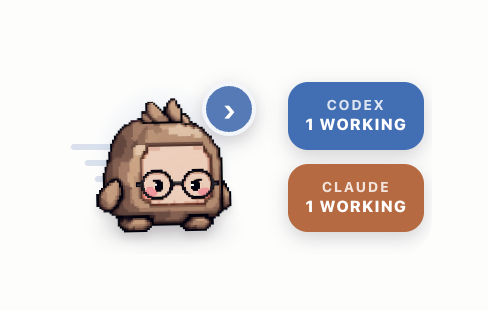

# QPet

QPet is a small, floating macOS companion for local Codex, Claude Code, and Cursor work. It turns coding-session lifecycle events into a tiny robot with an activity tray, without reading or storing prompts, transcripts, commands, or full assistant responses.

QPet is open source under the [MIT License](LICENSE). It is a personal, local-first app: no account, cloud service, or telemetry is required.

<p align="center">
  
</p>

## V0 behavior

- Watches new Codex, Claude Code, and Cursor sessions through user-level lifecycle hooks.
- Reconciles live Claude sessions with `claude agents --json`.
- Prioritizes pet activity as: **needs input → blocked → working → ready → idle**.
- Sends macOS notifications only when a session needs input or is blocked.
- Provides safe project, attach, resume, and copy-command actions without resuming a live session twice.
- Runs locally. It does not monitor Claude Desktop/web chats or embed a provider agent SDK.
- Cursor reports working and completion lifecycle states, but does not expose a reliable approval-request hook for QPet's Needs input state.

## Install from source

Requirements on the current target machine:

- Apple Silicon macOS
- Node.js 22+
- npm
- Optional: Codex CLI, Claude Code, and/or Cursor. QPet can be installed without all three;
  its onboarding reports each integration's availability.

```bash
git clone <your QPet GitHub clone URL> "$HOME/Developer/qpet"
cd "$HOME/Developer/qpet"
npm run doctor
npm ci
npm run install:mac
```

Keep the source checkout in a stable writable folder such as `~/Developer/qpet`;
use it later to update QPet. The installer builds an arm64 `QPet.app`, installs
it in `~/Applications` by default, and opens it. It does **not** modify Codex or
Claude, or Cursor configuration.

### First launch

1. Open `~/Applications/QPet.app`. Because the app is unsigned, macOS may
   require **Control-click → Open** the first time.
2. In QPet Settings, select **Install integrations** and review the detected
   providers.
3. In a new Codex CLI session, run `/hooks` and explicitly approve the QPet
   hook definition when prompted.
4. Start a new Codex CLI, Claude Code, or Cursor task and confirm QPet shows activity.

`npm run doctor` is a read-only preflight. It checks the supported Mac and
Node.js version, detects optional provider CLIs, and reports QPet's app, data,
and hook status. It never launches QPet or changes provider configuration.

To install into another writable folder:

```bash
npm run install:mac -- --app-dir "$HOME/Desktop"
```

### Agent-assisted installation

Open the cloned repository in Codex or Claude Code and give the agent this
prompt:

> Read `README.md` and `AGENTS.md`. Run `npm run doctor`, then verify the
> prerequisites. Run `npm ci`, `npm run typecheck`, `npm test`, and
> `npm run install:mac`. Do not edit `~/.codex` or `~/.claude` directly; leave
> integration installation for QPet's interactive Settings screen. Report any
> failed command with its exact output.

## Development

```bash
npm run dev
```

Quality checks:

```bash
npm run typecheck
npm test
npm run test:e2e
npm run package:mac
```

The packaged app is written to `release/mac-arm64/QPet.app`. The current
release target is Apple Silicon macOS. Intel Mac and Windows builds are not yet
supported.

For a manually packaged copy, use `~/Applications/QPet.app` (or another
writable app folder), open it, and complete the in-app integration setup. Run
`npm run smoke:package` after packaging to exercise the actual bundle.

## Integration setup

Open QPet Settings and choose **Install integrations**. QPet will:

1. Install a fail-open relay under `~/Library/Application Support/QPet/`.
2. Merge its handlers into `~/.codex/hooks.json`, `~/.claude/settings.json`, and `~/.cursor/hooks.json`.
3. Create timestamped, permission-preserving sidecar backups of changed files.
4. Leave `~/.codex/config.toml` untouched, including existing `notify` commands.

Codex requires explicit hook trust. After installation, open `/hooks` in a new Codex session and approve the QPet hook definition. QPet never bypasses this trust check.

Uninstalling integrations removes only handlers whose command points to QPet's installed relay. Hooks fail open within one second when QPet is not running.

## Troubleshooting

Run `npm run doctor` first; it prints the next action without changing anything.

- **macOS says QPet cannot be opened:** Control-click `~/Applications/QPet.app`
  and choose **Open** once.
- **Codex stays “Awaiting trust”:** start a new Codex CLI session, run
  `/hooks`, approve QPet, then submit one prompt while QPet is running.
- **A provider is not detected:** confirm `command -v codex`,
  `command -v claude`, or `command -v cursor` succeeds in Terminal, then use **Refresh** in QPet
  Settings.
- **QPet shows no activity:** only new Codex CLI, Claude Code, or Cursor sessions that emit
  hooks are visible. Recheck hook status with `npm run doctor`, then start a
  new CLI task.
- **Need a clean removal:** choose **Remove integrations** in QPet Settings
  before running `npm run uninstall:mac`.

## Uninstall

First open QPet Settings and choose **Remove integrations**. This removes only
QPet-owned handlers while preserving every unrelated Codex, Claude, and Cursor setting.
Then remove the app:

```bash
npm run uninstall:mac
```

The uninstall script removes only the installed `QPet.app`; it deliberately
does not touch `~/.codex`, `~/.claude`, `~/.cursor`, or QPet activity data. To remove QPet's
local metadata after integrations are removed, run:

```bash
npm run uninstall:mac -- --purge-data
```

## Local data and security

QPet listens only on an ephemeral `127.0.0.1` port. Each launch rotates a random bearer token stored in a mode-`0600` file. Incoming payloads are capped at 256 KiB and reduced immediately to normalized session metadata.

Persisted activity contains only provider, session ID, project path/name, generic state/summary, timestamps, unread/live flags, and an optional Claude background-job ID. Raw hook bodies are never written to disk.

This protects against accidental persistence and network exposure; it is not a hard boundary against another process already running as the same macOS user.

## Customize or contribute

The robot artwork lives in `assets/pet/`; renderer styling and state animations
live in `src/renderer/`. Provider hook parsing, privacy filtering, and session
actions remain in the main process so visual customization cannot widen QPet's
IPC surface.

See [CONTRIBUTING.md](CONTRIBUTING.md) for development and change guidelines,
and [SECURITY.md](SECURITY.md) for responsible disclosure.
